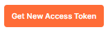
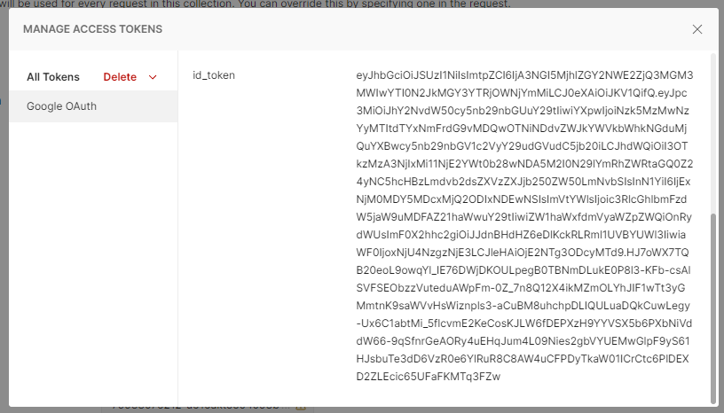
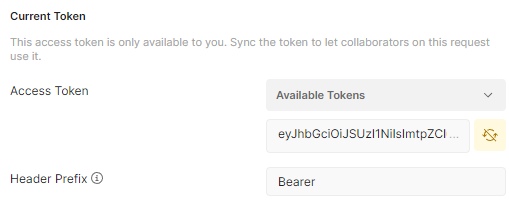

    

<h1 align="center">FunTime - Docs</h1>

## Contents

<ul>
<li><a href='https://github.com/Damandeep27/FunTime/blob/main/docs/FunTime-Full-Report.docx' target="_blank">FunTime's Full Report</a></li>
<li><a href='https://github.com/Damandeep27/FunTime/blob/main/docs/FunTime.postman_collection.json' target="_blank">Postman Exported Collection</a></li>
<li><a href='https://github.com/Damandeep27/FunTime/blob/main/docs/FunTime.postman_test_run.json' target="_blank">Postman Test Run Result</a></li>
</ul>

## Manual Testing

All request routes of FunTime is protected by an access token from google's OAuth. You can get a new token by importing [Postman Exported Collection](https://github.com/Damandeep27/FunTime/blob/main/docs/FunTime.postman_collection.json).

<ul>
<li>FunTime (Folder) -> Authorization -> Scroll to the bottom -> Get New Access Token</li>

<li>Inside Manage Access Tokens modal -> Copy id_token -> close the modal</li>

<li>Use the id_token as your access token by pasting it under Current Token</li>

</ul>

## Other

<ul>
<li><a href='https://hub.docker.com/repository/docker/stephenasuncion/funtime' target="_blank">DockerHub Repository</a></li>
<li><a href='https://github.com/Damandeep27/FunTime' target="_blank">GitHub Repository</a></li>
</ul>
